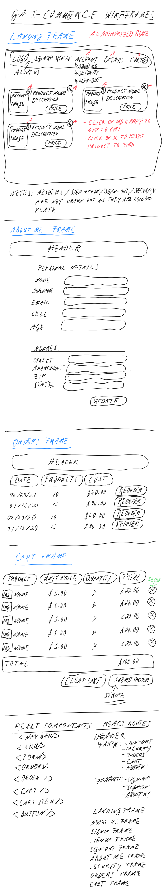

# E-Commerce Platform: Food4U

## Background

The genesis of Food4U is to add local distribution channels for farmers and to offer locally farmed seasonal produce to customers.
### Company Story
We pride ourselves in delivering fresh produce to your home! All our products are sourced exclusively from local farmers. This has the added benefit of being environmentally friendly. Our produce is local and seasonal so please bear with us if items are currently unavailable - our farmers are working hard on the next harvest! It goes without saying that all our farmers are exclusively No-GMO and all produce is certified organic. Save time by shopping on our app and we will deliver the products right to your home. We use Stripe to process your payment.

## Front-End Application
This repo is the front-end of the project. It was written using:
+ JavaScript
+ HTML
+ CSS/SCSS

The frameworks and libraries used, include:
+ React
+ Bootstrap
+ Lodash
+ Moment
+ Axios
+ Styled-components
+ Stripe implementation for payments processing

## Hosted Applications
### Front-end
The front-end app is hosted on [GitHub Pages](https://tech-it-out.github.io/Food4U-client/#/) and the repository can be found on [GitHub](https://github.com/Tech-It-Out/Food4U-client)

### Back-end
The back-end is deployed on [Heroku](https://salty-beyond-56482.herokuapp.com/) and the repository can be found on [GitHub](https://github.com/Tech-It-Out/food4u-api)

## Wireframes

## User Stories
+ As a registered user, I would like to sign in with email and password.
+ As an unregistered user, I would like to sign up with email and password.
+ As a signed in user, I would like to change password.
+ As a signed in user, I would like to sign out.
+ As an unregistered user, I would like to see all of the products.
+ As a signed in user, I would like to add and remove products from a shopping cart.
+ As a signed in user, I would like to purchase products in a shopping cart using Stripe with react azmenak/react-stripe-checkout
+ As a signed in user, I would like to see all my past orders.

## Planning Documentation
The development team used GitHub's project management [Kanban](https://github.com/orgs/Tech-It-Out/projects/2?add_cards_query=is%3Aopen) for macro project development and planning purpose.

For front-end specific planning issues the team used GitHub's project management [Kanban](https://github.com/Tech-It-Out/Food4U-client/projects) that sits inside the repo.

## Next Development Phase
1. Build a stock-keeping / inventory balance into the product collection such that customers can only check out items / add items to the cart that are in stock.
1. instead of using Stripe's hosted payment page, build proprietary one that enables the customer to never leave the company website
1. Add favourites
1. Search for products
